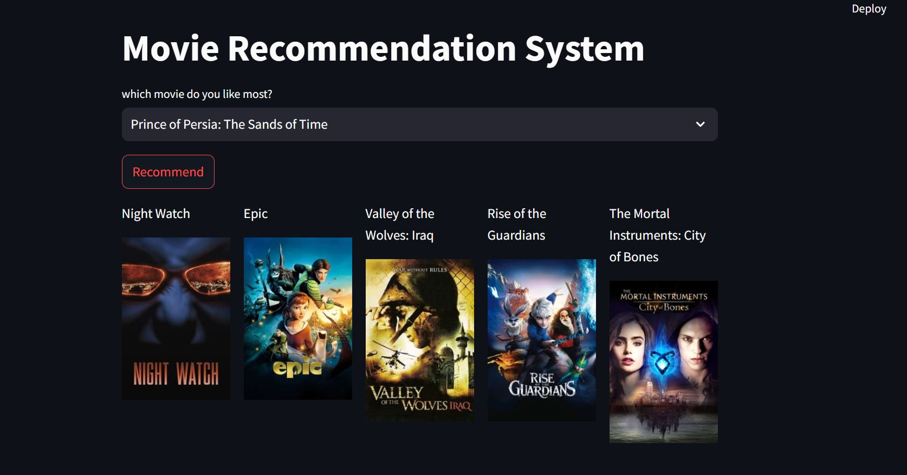

# **Content-Based Movie Recommendation System**

This project is a movie recommendation system that suggests similar movies based on their metadata, such as genres, cast, crew, keywords, and overview. Built using Python, the system leverages natural language processing (NLP) techniques and cosine similarity to recommend movies.

## **Features**
- Provides personalized movie recommendations based on metadata similarity.
- Processes large datasets with advanced text preprocessing techniques.
- Displays the top 5 recommended movies with their details.
- Ready for deployment with serialized models and data.

## **Tech Stack**
- **Programming Language:** Python  
- **Libraries and Tools:**  
  - Data Processing: Pandas, NumPy  
  - Text Processing: NLTK, Scikit-learn  
  - Deployment: Pickle  
  - Visualization: Streamlit (optional for front-end integration)

## **How It Works**
1. **Data Preprocessing:**
   - Merges and cleans datasets from TMDb.
   - Extracts meaningful metadata such as genres, cast, crew, and keywords.
   - Combines the metadata into a unified feature space (`tags` column).
2. **Text Processing:**
   - Applies stemming and vectorizes the `tags` column using **CountVectorizer**.
3. **Recommendation System:**
   - Computes similarity between movies using **cosine similarity**.
   - Suggests the top 5 most similar movies based on the user's choice.
4. **Deployment:**
   - Serializes the processed data and similarity matrix for efficient re-use.

# **ScreenShots**

